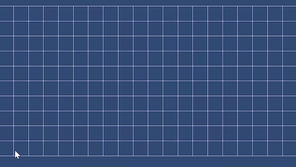
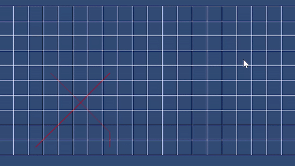

# Multi agent pathfinding

The concept of multi-agent pathfinding involves orchestrating multiple agents to determine individual paths toward their respective goals while simultaneously avoiding collisions with one another. This text outlines a demonstration of this principle, exemplifying the pathfinding processes for scenarios involving both collision-free and collision-prone situations.

## Demo

Pathfinding of 2 agents without collision

A demonstration showcasing the successful pathfinding of two agents operating independently without encountering collisions.

Pathfinding of 2 agents with collision and path recalculation

A demo that illustrates the pathfinding of two agents who encounter a collision along their routes. This results in path recalculation to circumvent the collision.

Pathfinding of multiple Agents with obstacles and collisions
Demonstration of multi-agent pathfinding in the presence of bbstacles and collisions between agents.

## How does it work

#### A* pathfinding

-Initially, each agent employs the A* pathfinding algorithm to compute an optimal path to its designated goal.

#### Collision checks

-Subsequent to individual path computation, collision checks are performed among agents to detect potential intersections.
-If two agents' paths intersect at any point, a collision is flagged.

#### Recalculate path

-In case of collision, the path of the colliding agent is recalculated to evade the collision point.
The process is reiterated until a collision-free trajectory is established.

## Implementation

-The showcased demonstration is realized using the Unity game engine, utilizing the C# programming language to execute the required functionalities.

#### Internal Structure

-Each participating agent maintains a list of vectors that define its respective path.
-Collision detection involves the comparison of path lists between different agents.
-A collision incident is identified when two path segments, equidistant in terms of steps from their respective starting points, intersect.
-Collision points are logged, forming a list of vectors denoting areas to be avoided during subsequent path calculations.
#### Requirements

-Unity

## Results

The agents correctly recalculate paths but this way of calculating the path does not yield the most optimal path for each agent since it recalculates the path for all agents after a collision.

## Useful Links

#### Multi-Agent Pathfinding
-Multi agent pathfinding:
https://ai.vub.ac.be/multi-agent-path-finding/?utm_source=www.google.com&utm_medium=organic&utm_campaign=Google&referrer-analytics=1
-Conflict-based search for optimal multi-agent pathfinding: https://www.sciencedirect.com/science/article/pii/S0004370214001386